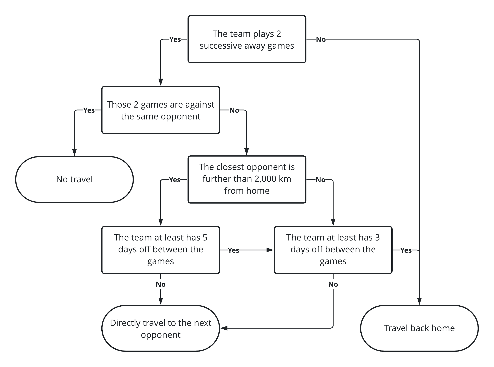

I'm sure I'm not the only one out there who was very enthusiastic when the National Hockey League
(NHL) [unveiled its newly reshuffled divisions](https://www.nhl.com/news/nhl-teams-in-new-divisions-for-2020-21-season/c-319844882)
ahead of the 2021 season. I was secretly dreaming of an all-Canadian division for a long time, but
never I thought that this dream could ever materialize. We're entitled to expect electrifying
hockey for the upcoming season, and some rivalries will certainly reach a higher, more emotional
level, but what about the effect of this reshuffling on team traveling?

<!--more-->

This post is the first of a series in which I will explore and explain different features of the
<i class="fab fa-r-project"></i> package [`tidynhl`](https://jplecavalier.github.io/tidynhl/), a
personal project that is slowly but surely taking shape. The purpose of this package is to give
access to NHL data by facilitating the interaction with their open stats API, and to provide this
data on a ready-to-use and clean (or tidy) format.

```{r setup, include=FALSE}
knitr::opts_chunk$set(
  fig.path = "figs-en/"
)

ggplot2::theme_update(
  
  panel.grid.major.y = ggplot2::element_blank(),
  legend.title = ggplot2::element_blank(),
  legend.position = "bottom",
  axis.title.y = ggplot2::element_blank()
  
)
```

## Team schedules for the 2021 season

To begin, let's get and print an excerpt of the NHL 2021 schedule with the `tidy_schedule()`
function.

```{r get_2021_schedule}
# Load the packages
library(data.table)
library(tidynhl)

# Get the 2021 NHL schedule
nhl_schedule_2021 <- tidy_schedule(
  seasons_id = "20202021",
  playoffs = FALSE
)

# Print an excerpt
nhl_schedule_2021[]
```

Then, we will drop the useless columns and duplicate the rows in order to get a view of the schedule
in the perspective of every teams. These steps will be proceded inside a function so we will be able
to reuse it in a later section of the post.

```{r team_view}
# Define the create_teams_schedule() function
create_teams_schedule <- function(nhl_schedule) {
  
  teams_schedule <- rbindlist(list(
    nhl_schedule[, .(
      season = season_years,
      date = as.Date(game_datetime, tz = Sys.timezone()),
      status = "away",
      team = away_team,
      opponent = home_team
    )],
    nhl_schedule[, .(
      season = season_years,
      date = as.Date(game_datetime, tz = Sys.timezone()),
      status = "home",
      team = home_team,
      opponent = away_team
    )]
  ))
  
  teams_schedule[, venue := ifelse(status == "home", team, opponent)]
  
  setkey(teams_schedule, season, team, date)
  
  teams_schedule[]
  
}

# Call the function with the 2021 schedule
teams_schedule_2021 <- create_teams_schedule(nhl_schedule_2021)

# Print an excerpt
teams_schedule_2021[]
```

## Feature engineering

The aim of this section is to create new features in the data representing the connection between
successive games. Once again, this will be implemented through a reusable function that will create
new columns indicating the date and location of the previous game. This function is created and
called with our data in the code chunk below.

```{r last_game}
# Define the add_last_game() function
add_last_game <- function(teams_schedule) {
  
  teams_schedule[, `:=`(
    last_date = c(as.Date(NA), date[-.N]),
    last_venue = c(team, venue[-.N])
  ), .(season, team)]
  
}

# Call the function with the 2021 teams schedule
add_last_game(teams_schedule_2021)

# Print an excerpt
teams_schedule_2021[]
```

Then, we create another different table in which we will compute distances between any pair of team
venues. For the sake of simplicity, we'll make the hypothesis that distances are calculated as the
crow flies. The [`geosphere`](http://r-forge.r-project.org/projects/geosphere/) package provides an
easy way to perform this with its `distm()` function.

In the chunk below, we will first retrieve metadata for each team (two of which are their venue's
geographic coordinates and their actual division) using the `tidy_teams_meta()` function. We'll then
compute a distance matrix as specified earlier and reorganize it as a table to make an eventual
merge easier.

```{r venues_distance}
# Load the package
library(geosphere)

# Get teams' metadata
teams_meta <- tidy_teams_meta()

# Print an excerpt
teams_meta[]

# Compute a distance matrix in km
venues_matrix <- round(distm(teams_meta[, .(venue_active_long, venue_active_lat)]) / 1000L)

# Convert it to a table
teams_distances <- setDT(
  expand.grid(team = teams_meta[, team_abbreviation], opponent = teams_meta[, team_abbreviation])
)[, distance := as.integer(venues_matrix)]

# Print an excerpt
teams_distances[]
```

## Travel analysis

Afin d'être en mesure de faire notre analyse, on doit tout d'abord poser d'autres hypothèses, cette
fois par rapport à la fréquence de déplacement des équipes. Évidemment, celles-ci ne sont pas
nécessairement exactes, mais j'ai essayé de construite un algorithme balancé entre simplicité et
réalité.

On pose donc les hypothèses suivantes :

- Chaque équipe est basée à son domicile en début de saison;
- Les déplacements à l'étranger sont effectués selon l'algorithme présenté ci-dessous.
    


On peut faire un exemple concret en appliquant ces hypothèses au début de saison des
[Canadiens de Montréal](https://www.nhl.com/en/canadiens) pour bien comprendre. On obtient alors,
pour les deux premières semaines de leur calendrier, les voyages suivants :

*January 13th 2021 game (MTL @ TOR)*

- L'équipe est basée à MTL en début de saison

**&rArr; Outcome: Traveling from MTL to TOR `r emoji("airplane")`**

***

*January 16th 2021 game (MTL @ EDM)*

- L'équipe joue 2 matchs consécutifs sur la route (13 et 16 janvier)
- Ces deux matchs ne sont pas contre le même adversaire (TOR et EDM)
- L'adversaire le plus près (TOR) n'est pas à plus de 2000 km de MTL
- L'équipe n'a pas 3 jours de congé entre les matchs (seulement les 14 et 15 janvier)

**&rArr; Outcome: Traveling from TOR to EDM `r emoji("airplane")`**

***

*January 18th 2021 game (MTL @ EDM)*

- L'équipe joue 2 matchs consécutifs sur la route (16 et 18 janvier)
- Ces deux matchs sont contre le même adversaire (EDM)

**&rArr; Outcome: Not traveling `r emoji("hotel")`**

***

*January 20th 2021 game (MTL @ VAN)*

- L'équipe joue 2 matchs consécutifs sur la route (18 et 20 janvier)
- Ces deux matchs ne sont pas contre le même adversaire (EDM et VAN)
- L'adversaire le plus près (EDM) est à plus de 2000 km de MTL
- L'équipe n'a pas 5 jours de congé entre les matchs (seulement le 19 janvier)

**&rArr; Outcome: Traveling from EDM to VAN `r emoji("airplane")`**

***

*January 21st 2021 game (MTL @ VAN)*

- L'équipe joue 2 matchs consécutifs sur la route (20 et 21 janvier)
- Ces deux matchs sont contre le même adversaire (VAN)

**&rArr; Outcome: Not traveling `r emoji("hotel")`**

***

*January 23rd 2021 game (MTL @ VAN)*

- L'équipe joue 2 matchs consécutifs sur la route (21 et 23 janvier)
- Ces deux matchs sont contre le même adversaire (VAN)

**&rArr; Outcome: Not traveling `r emoji("hotel")`**

***

*January 28th 2021 game (CGY @ MTL)*

- L'équipe ne joue pas 2 matchs consécutifs sur la route

**&rArr; Outcome: Traveling from VAN to MTL `r emoji("airplane")`**

On crée maintenant une fonction implantant cet algorithme et on l'applique à l'ensemble des équipes
pour le calendrier 2021.

```{r travel_view}
# Define the create_teams_travels() function
create_teams_travels <- function(teams_schedule) {
  
  teams_travels <- teams_schedule[, rbindlist(mapply(
    FUN = function(team, venue, last_venue, off_days) {
    
      # Prevent names colliding
      TEAM <- team
      
      # No travel
      if (venue == last_venue) {
        return(NULL)
      }
      
      # Travel to next game
      if (is.na(off_days) | off_days < 3L | team %in% c(venue, last_venue)) {
        return(list(
          from = last_venue,
          to = venue
        ))
      }
      
      # Minimal distance from home
      distance <- teams_distances[team == TEAM & opponent %in% c(venue, last_venue), min(distance)]
      
      # Travel home + Travel to next game
      if (off_days >= 5L | (off_days >= 3L & distance <= 2000L)) {
        return(list(
          from = c(last_venue, team),
          to = c(team, venue)
        ))
      }
      
      # Travel to next game
      list(
        from = last_venue,
        to = venue
      )
    
    },
    team = team,
    venue = venue,
    last_venue = last_venue,
    off_days = date - last_date - 1L,
    SIMPLIFY = FALSE
  )), .(season, team)]
  
  # Add travel distances
  teams_travels[teams_distances, distance := distance, on = c(from = "team", to = "opponent")]
  
  # Output
  teams_travels[]

}

# Call the function with the 2021 teams schedule
teams_travels_2021 <- create_teams_travels(teams_schedule_2021)

# Print an excerpt
teams_travels_2021[]
```

On peut facilement valider que notre exemple pour le début de saison des Canadiens est bien
représenté par l'algorithme.

```{r mtl_head}
teams_travels_2021[team == "MTL"][1:4]
```

On crée ensuite un sommaire par équipe indiquant la distance totale qui sera parcourue au cours de
la saison 2021 auquel on vient ajouter la division actuelle de chaque équipe.

```{r summary_2021}
# Define the create_teams_travel_summary() function
create_teams_travel_summary <- function(teams_travels, nhl_schedule) {
  
  # Create a summary table
  teams_travel_summary <- teams_travels[, .(
    nb = .N,
    km = sum(distance)
  ), .(season, team)]
  
  # Add the km per day variable
  nhl_season_days <- nhl_schedule[, .(
    season_years = season_years,
    game_date = as.Date(game_datetime, tz = Sys.timezone())
  )][, .(days = as.integer(max(game_date) - min(game_date) + 1L)), season_years]
  teams_travel_summary[nhl_season_days, days := days, on = c(season = "season_years")]
  teams_travel_summary[, km_per_day := km / days]
  
  # Add the divisions
  teams_travel_summary[teams_meta, division := division_active_name, on = c(team = "team_abbreviation")]
  
  # Output
  teams_travel_summary[]
  
}

# Call the function with 2021 teams travels
teams_travel_summary_2021 <- create_teams_travel_summary(teams_travels_2021, nhl_schedule_2021)

# Print an excerpt
teams_travel_summary_2021[]
```

On affiche maintenant un graphique permettant de visualiser cette information pour l'ensemble des
équipes de la ligue. On utilise respectivement les *packages*
[`ggplot2`](https://ggplot2.tidyverse.org) et [`scales`](https://scales.r-lib.org) pour créer le
graphique et en modifier le formatage.

```{r plot_summary_2021, fig.height=8}
# Load the packages
library(ggplot2)
library(scales)

# Create the plot
ggplot(
  data = teams_travel_summary_2021,
  mapping = aes(
    x = km,
    y = reorder(as.factor(team), km),
    fill = division
  )
) +
  geom_col() +
  scale_x_continuous(
    labels = label_number(big.mark = ","),
    expand = expansion(mult = c(0, 0.05))
  ) +
  scale_fill_brewer(palette = "Set1") +
  labs(
    title = "Total traveling distance by team",
    subtitle = "NHL 2021 season",
    x = "Distance (km)"
  )
```

Comme on pouvait s'y en attendre, les équipes près de la région métropolitaine de New York sont
celles qui auront la plus petite distance à parcourir. On voit clairement que les équipes de la
division canadienne sont celles qui, en moyenne, parcoureront le plus de kilomètres pendant la
saison. Cependant, la distribution à l'intérieur de cette division est assez uniforme, ce qui n'est
pas le cas pour la division ouest. Alors que les Ducks n'auront qu'un peu plus de 17 000 km à
parcourir pendant la saison, les Blues en parcoureront près de 35 000 (plus du double
`r emoji("face_screaming_in_fear")`!) pendant la même période. Reste à voir si ce sera assez pour
permettre aux Ducks de compenser pour leur manque de talent offensif...


Une chose est certaine, si la fatigue accumulée générée en raison du voyagement pendant la saison
s'avère être un bon indicateur de la performance des joueurs en séries, la division est partira avec
un avantage considérable sur ses adversaires au printemps prochain.

## Comparing with previous seasons

Bien que la statistique absolue du nombre de kilomètres à parcourir pour chaque équipe lors de la
saison 2021 soit intéressante, on pourrait aussi s'intéresser au changement relatif qu'apportent ces
nouvelles divisions et ce nouveau calendrier à chaque équipe. Pour ce faire, on comparera la saison
2021 aux saisons entre 2013-14 (dernier remaniement de divisions avant 2021) et 2019-20
inclusivement.

On applique donc les fonctions créées dans la section précédente une à la suite de l'autre. Ensuite,
on calcule la moyenne de certaines métriques d'intérêt sur ces 7 saisons.

```{r summary_20132020}
# Get the 2013-14 to 2019-20 NHL schedule
nhl_schedule_20132020 <- tidy_schedule(
  seasons_id = paste0(2013:2019, 2014:2020),
  playoffs = FALSE
)

# Replace PHX by ARI
nhl_schedule_20132020[away_team == "PHX", away_team := "ARI"]
nhl_schedule_20132020[home_team == "PHX", home_team := "ARI"]

# Create teams' schedule
teams_schedule_20132020 <- create_teams_schedule(nhl_schedule_20132020)

# Transform the data
add_last_game(teams_schedule_20132020)

# Create team's travels
teams_travels_20132020 <- create_teams_travels(teams_schedule_20132020)

# Create team's travels summary by season
teams_travel_summary_20132020 <- create_teams_travel_summary(teams_travels_20132020, nhl_schedule_20132020)

# Create team's travels summary
teams_travel_summary_20132020 <- teams_travel_summary_20132020[, .(
  season = "2013-20",
  km_avg = mean(km),
  km_per_day_avg = sum(km) / sum(days)
), .(team, division)]

# Print an excerpt
teams_travel_summary_20132020[]
```

Afin de comparer des pommes avec des pommes, on utilisera cette fois-ci la métrique de kilomètres
parcourus en moyenne par jour pendant la saison. Cette métrique normalisera donc les saisons
écourtées de 2019-20 et 2021 à un niveau comparable aux autres.

On affiche donc un graphique illustrant la réduction des déplacements quotidiens moyens par équipe
pour la saison 2021 comparativement à la période de référence. Les résultats sont triés en ordre de
diminution relative.

```{r plot_summary_201321, fig.height=8}
# Create comparative summary
teams_travel_summary <- copy(teams_travel_summary_2021[, .(team, division, km_per_day_2021 = km_per_day)])
teams_travel_summary[teams_travel_summary_20132020, km_per_day_201320 := km_per_day_avg, on = .(team)]
teams_travel_summary[, km_per_day_cut := (km_per_day_2021 / km_per_day_201320) - 1]

# Create the plot
ggplot(
  data = teams_travel_summary,
  mapping = aes(
    y = reorder(as.factor(team), km_per_day_cut),
    fill = division
  )
) +
  geom_col(aes(x = km_per_day_2021), alpha = 1) +
  geom_col(aes(x = km_per_day_201320), alpha = 0.5) +
  geom_text(
    mapping = aes(
      x = km_per_day_2021,
      label = percent(km_per_day_cut, 1)
    ),
    nudge_x = 2,
    hjust = 0
  ) +
  scale_x_continuous(
    labels = label_number(big.mark = ","),
    expand = expansion(mult = c(0, 0.05))
  ) +
  scale_fill_brewer(palette = "Set1") +
  labs(
    title = "Traveling reduction by team",
    subtitle = "2021 vs 2013-14 to 2019-20 NHL seasons",
    x = "Average daily traveling distance (km)"
  )
```

Sans surprise, on voit que le fait de disputer plusieurs matchs consécutifs contre le même
adversaire réduit le déplacement annuel pour l'ensemble des équipes. Les grands gagnants de ce
remaniement sont les équipes de la division est et ceux en retirant les bénéfices les moins
importants (quoi que tout de même significatifs) sont principalement les équipes canadiennes. Ceci
étant dit, mon coeur de partisan des Canadiens est toujours satisfait de voir les Leafs en dernière
position d'un classement quel qu'il soit `r emoji("beaming_face_with_smiling_eyes")`.

## Conclusion

Bien que cet article mette en lumière l'asymétrie réelle qu'amènent ces nouvelles divisions au
niveau du voyagement des équipes, il demeure très difficile de prédire si cela aura un effet
quelconque sur leurs performances sur la glace. Une tonne d'impondérables se manifesteront au
courant de la saison et ceux-ci risquent d'avoir encore plus de poids dans la balance. De plus,
n'oublions pas que le calendrier présenté dans l'article est à jour en date d'aujourd'hui mais qu'il
risque fortement d'évoluer en cours de route lorsque des éclosions de COVID-19 surviendront. Bref,
soyons patients et apprécions le spectacle!


