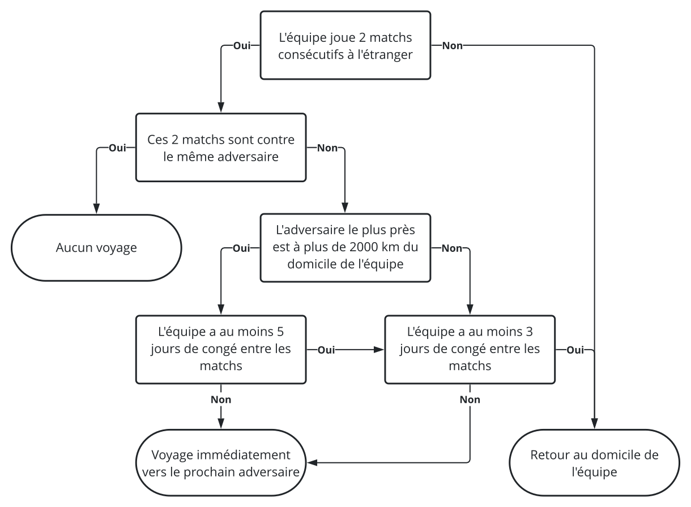

J'imagine que, tout comme moi, plusieurs parmi vous étiez particulièrement enthousiastes lorsque la Ligue Nationale de Hockey (LNH)
[a dévoilé les divisions](https://www.nhl.com/news/nhl-teams-in-new-divisions-for-2020-21-season/c-319844882) qui seront
utilisées tout au long de la présente saison. Ça fait des années que je rêvais secrètement d'une division canadienne, mais je n'avais jamais cru que mon rêve
deviendrait réalité. On aura droit à du hockey électrisant et certaines rivalités passeront probablement à un niveau supérieur, mais qu'en est-il de l'impact
qu'auront ces divisions sur le voyagement des équipes?

<!--more-->

Cet article est le premier d'une série de plusieurs dans lesquels j'explorerai différentes fonctionnalités du package <i class="fab fa-r-project"></i>
[`tidynhl`](https://jplecavalier.github.io/tidynhl/), un projet personnel qui, lentement mais sûrement, prend forme. Le but de celui-ci est de faciliter
l'accès aux données de la LNH en utilisant leur API ouvert de statistiques.

Le but de l'article est donc d'analyser l'impact qu'a sur le voyagement de chaque équipe l'implantation de ces nouvelles divisions temporaires en utilisant
[`tidynhl`](https://jplecavalier.github.io/tidynhl/).

```{r setup, include=FALSE}
knitr::opts_chunk$set(
  fig.path = "figs-fr/"
)

options(
  DT.options = c(options()$DT.options, list(
    language = list(
      url = "//cdn.datatables.net/plug-ins/1.10.22/i18n/French.json"
    )
  ))
)
```

## Construction du calendrier 2021 des équipes

Pour commencer, on charge et on affiche un extrait du calendrier 2021 de la LNH à l'aide de la fonction `tidy_schedule()`.

```{r get_2021_schedule}
# Charger les packages
library(data.table)
library(tidynhl)

# Obtenir le calendrier 2021 de la LNH
nhl_schedule_2021 <- tidy_schedule(
  seasons_id = "20202021",
  playoffs = FALSE
)

# Afficher un extrait du calendrier
nhl_schedule_2021[]
```

On fait ensuite une transformation des données pour garder les colonnes d'intérêt et dupliquer les lignes dans le but d'avoir une vue pour chaque équipe. Ces
étapes seront traitées à l'intérieur d'une fonction afin d'être réutilisées un peu plus loin dans l'article.

```{r team_view}
# Définir la fonction create_team_view()
create_team_view <- function(schedule) {
  
  schedule <- rbindlist(list(
    schedule[, .(
      season = season_years,
      date = as.Date(game_datetime, tz = Sys.timezone()),
      status = "away",
      team = away_team,
      opponent = home_team
    )],
    schedule[, .(
      season = season_years,
      date = as.Date(game_datetime, tz = Sys.timezone()),
      status = "home",
      team = home_team,
      opponent = away_team
    )]
  ))
  
  schedule[, venue := ifelse(status == "home", team, opponent)]
  
  setkey(schedule, season, team, date)
  
  schedule[]
  
}

# Appliquer la fonction au calendrier 2021
teams_schedule_2021 <- create_team_view(nhl_schedule_2021)

# Afficher un aperçu
teams_schedule_2021[]
```

## Transformation des données

L'objectif de cette section est de mettre en relation les matchs successifs des équipes. On définit donc une fonction qui créera de nouvelles colonnes dans
lesquelles on va indiquer la date et l'endroit du dernier match. On applique cette fonction à nos données ci-dessous.

```{r last_game}
# Définir la fonction add_last_game()
add_last_game <- function(teams_schedule) {
  
  teams_schedule[, `:=`(
    last_date = c(as.Date(NA), date[-.N]),
    last_venue = c(team, venue[-.N])
  ), .(season, team)]
  
}

# Appliquer la fonction au calendrier 2021
add_last_game(teams_schedule_2021)

# Afficher un aperçu
teams_schedule_2021[]
```

On crée ensuite une autre table dans laquelle on viendra calculer les distances entre le domicile des différentes équipes. À des fins de simplicité, on pose
l'hypothèse que toutes les distances sont calculées à vol d'oiseau entre ceux-ci. Pour ce faire, on va utiliser la fonction `distm()` du *package*
[`geosphere`](http://r-forge.r-project.org/projects/geosphere/).

Les emplacements des amphitéâtres de chaque équipe ne sont pas disponibles (du moins pour l'instant) avec l'API de la LNH. Vous pouvez donc télécharger un
fichier dans lequel je fournis ces informations [ici](data.zip). On charge ces données et on calcule une matrice des distances dans le bloc ci-dessous. On
transformera ensuite cette matrice en table pour en faciliter l'interrogation.

```{r venues_distance}
# Charger le package
library(geosphere)

# Charger les données sur les amphitéâtres
venues <- fread("data/venues.csvy", yaml = TRUE)

# Afficher un aperçu
venues[]

# Calculer une matrice des distances en km
venues_matrix <- round(distm(venues[, .(venue_long, venue_lat)])/1000L)

# Convertir sous la forme d'une table
teams_distance <- setDT(
  expand.grid(team = venues[, team], opponent = venues[, team])
)[, distance := as.integer(venues_matrix)]

# Afficher un aperçu
teams_distance[]
```

## Analyse des déplacements

Afin d'être en mesure de faire notre analyse, on doit tout d'abord poser d'autres hypothèses, cette fois par rapport à la fréquence de déplacement des équipes.
Évidemment, celles-ci ne seront pas nécessairement exactes, mais j'essaierai de construite un algorithme balancé entre simplicité et réalité.

On pose donc les hypothèses suivantes :

- Chaque équipe est basée à son domicile en début de saison;
- Les déplacements à l'étranger sont effectués selon l'algorithme présenté ci-dessous.
    


On peut faire un exemple concret en appliquant ces hypothèses au début de saison des [Canadiens de Montréal](https://www.nhl.com/fr/canadiens) pour bien
comprendre. On obtient alors, pour les deux premières semaines de leur calendrier les voyages suivants :

*Match du 13 janvier 2021 (MTL @ TOR)*

- L'équipe est basée à MTL en début de saison

**&rArr; Verdict : Voyage de MTL vers TOR `r emoji("airplane")`**

***

*Match du 16 janvier 2021 (MTL @ EDM)*

- L'équipe joue 2 matchs consécutifs sur la route (13 et 16 janvier)
- Ces deux matchs ne sont pas contre le même adversaire (TOR et EDM)
- L'adversaire le plus près (TOR) n'est pas à plus de 2000 km de MTL
- L'équipe n'a pas 3 jours de congé entre les matchs (seulement les 14 et 15 janvier)

**&rArr; Verdict : Voyage de TOR vers EDM `r emoji("airplane")`**

***

*Match du 18 janvier 2021 (MTL @ EDM)*

- L'équipe joue 2 matchs consécutifs sur la route (16 et 18 janvier)
- Ces deux matchs sont contre le même adversaire (EDM)

**&rArr; Verdict : Aucun voyage `r emoji("hotel")`**

***

*Match du 20 janvier 2021 (MTL @ VAN)*

- L'équipe joue 2 matchs consécutifs sur la route (18 et 20 janvier)
- Ces deux matchs ne sont pas contre le même adversaire (EDM et VAN)
- L'adversaire le plus près (EDM) est à plus de 2000 km de MTL
- L'équipe n'a pas 5 jours de congé entre les matchs (seulement le 19 janvier)

**&rArr; Verdict : Voyage de EDM vers VAN `r emoji("airplane")`**

***

*Match du 21 janvier 2021 (MTL @ VAN)*

- L'équipe joue 2 matchs consécutifs sur la route (20 et 21 janvier)
- Ces deux matchs sont contre le même adversaire (VAN)

**&rArr; Verdict : Aucun voyage `r emoji("hotel")`**

***

*Match du 23 janvier 2021 (MTL @ VAN)*

- L'équipe joue 2 matchs consécutifs sur la route (21 et 23 janvier)
- Ces deux matchs sont contre le même adversaire (VAN)

**&rArr; Verdict : Aucun voyage `r emoji("hotel")`**

***

*Match du 28 janvier 2021 (CGY @ MTL)*

- L'équipe ne joue pas 2 matchs consécutifs sur la route

**&rArr; Verdict : Voyage de VAN vers MTL `r emoji("airplane")`**

On crée maintenant une fonction implantant cet algorithme et on l'applique à l'ensemble des équipes pour le calendrier 2021.

```{r travel_view}
# Définir la fonction create_travel_view()
create_travel_view <- function(teams_schedule) {
  
  travels <- teams_schedule[, rbindlist(mapply(
    FUN = function(team, venue, last_venue, off_days) {
    
      # Empêcher les collisions
      TEAM <- team
      
      # Aucun voyage
      if (venue == last_venue) {
        return(NULL)
      }
      
      # Direction prochain match
      if (is.na(off_days) | off_days<3L | team %in% c(venue, last_venue)) {
        return(list(
          from = last_venue,
          to = venue
        ))
      }
      
      # Distance minimale du domicile
      distance <- teams_distance[team == TEAM & opponent %in% c(venue, last_venue), min(distance)]
      
      # Direction domicile + Direction prochain match
      if (off_days>=5L | (off_days>=3 & distance<=2000)) {
        return(list(
          from = c(last_venue, team),
          to = c(team, venue)
        ))
      }
      
      # Direction prochain match
      list(
        from = last_venue,
        to = venue
      )
    
    },
    team = team,
    venue = venue,
    last_venue = last_venue,
    off_days = date-last_date-1L,
    SIMPLIFY = FALSE
  )), .(season, team)]
  
  # Ajouter la distance des voyages
  travels[teams_distance, distance:=distance, on=c(from="team", to="opponent")]
  
  # Appeler la valeur de sortie
  travels[]

}

# Appliquer la fonction au calendrier 2021 des équipes
teams_travel_2021 <- create_travel_view(teams_schedule_2021)

# Afficher un aperçu
teams_travel_2021[]
```

On crée ensuite un sommaire par équipe indiquant le voyagement total en km pour la saison 2021 et on affiche l'ensemble des résultats dans un tableau
interactif créé avec le *package* [`DT`]().

```{r summary_2021}
# Charger le package
library(DT)

# Afficher le tableau interactif
teams_travel_2021[, .(
  travels_nb = .N,
  travels_sum_km = sum(distance)
), team] %>%
  datatable(
    colnames = c(
      "Équipe" = "team",
      "Nombre de voyages" = "travels_nb",
      "Distance totale parcourue (km)" = "travels_sum_km"
    )
  )
```
