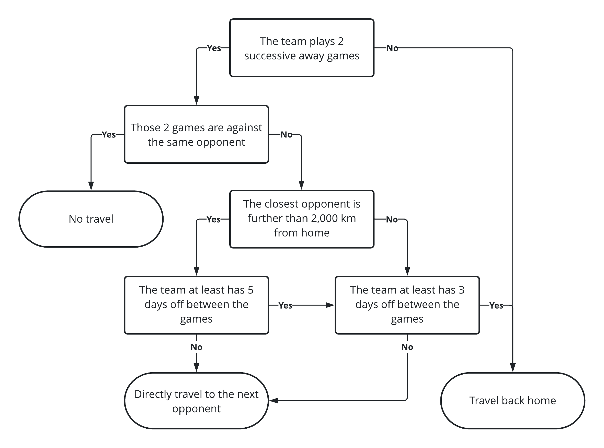

I'm sure I'm not the only one out there who was very enthusiastic when the National Hockey League
(NHL) [unveiled its newly reshuffled divisions](https://www.nhl.com/news/nhl-teams-in-new-divisions-for-2020-21-season/c-319844882)
ahead of the 2021 season. I was secretly dreaming of an all-Canadian division for a long time, but
never I thought that this dream could ever materialize. We're entitled to expect electrifying
hockey for the upcoming season, and some rivalries will certainly reach a higher, more emotional
level, but what about the effect of this reshuffling on team traveling?

<!--more-->

This post is the first of a series in which I will explore and explain different features of the
<i class="fab fa-r-project"></i> package [`tidynhl`](https://jplecavalier.github.io/tidynhl/), a
personal project that is slowly but surely taking shape. The purpose of this package is to give
access to NHL data by facilitating the interaction with their open stats API, and to provide this
data on a ready-to-use and clean (or tidy) format.

```{r setup, include=FALSE}
knitr::opts_chunk$set(
  fig.path = "figs-en/"
)

ggplot2::theme_update(
  
  panel.grid.major.y = ggplot2::element_blank(),
  legend.title = ggplot2::element_blank(),
  legend.position = "bottom",
  axis.title.y = ggplot2::element_blank()
  
)
```

## Team schedules for the 2021 season

To begin, let's get and print an excerpt of the NHL 2021 schedule with the `tidy_schedules()`
function.

```{r get_2021_schedule}
# Load the packages
library(data.table)
library(tidynhl)

# Get the 2021 NHL schedule
nhl_schedule_2021 <- tidy_schedules(
  seasons_id = "20202021",
  playoffs = FALSE
)

# Print an excerpt
nhl_schedule_2021[]
```

Then, we will drop the useless columns and duplicate the rows in order to get a view of the schedule
in the perspective of every teams. These steps will be done inside a function that will be reuse in
a later section of the post.

```{r team_view}
# Define the create_teams_schedule() function
create_teams_schedule <- function(nhl_schedule) {
  
  teams_schedule <- rbindlist(list(
    nhl_schedule[, .(
      season = season_years,
      date = as.Date(game_datetime, tz = Sys.timezone()),
      status = "away",
      team = away_abbreviation,
      opponent = home_abbreviation
    )],
    nhl_schedule[, .(
      season = season_years,
      date = as.Date(game_datetime, tz = Sys.timezone()),
      status = "home",
      team = home_abbreviation,
      opponent = away_abbreviation
    )]
  ))
  
  teams_schedule[, venue := ifelse(status == "home", team, opponent)]
  
  setkey(teams_schedule, season, team, date)
  
  teams_schedule[]
  
}

# Call the function with the 2021 schedule
teams_schedule_2021 <- create_teams_schedule(nhl_schedule_2021)

# Print an excerpt
teams_schedule_2021[]
```

## Feature engineering

The aim of this section is to create new features in the data representing the connection between
successive games. Once again, this will be implemented through a reusable function that will create
new columns indicating the date and location of the previous game. This function is created and
called on our data in the code chunk below.

```{r last_game}
# Define the add_last_game() function
add_last_game <- function(teams_schedule) {
  
  teams_schedule[, `:=`(
    last_date = c(as.Date(NA), date[-.N]),
    last_venue = c(team, venue[-.N])
  ), .(season, team)]
  
}

# Call the function with the 2021 teams schedule
add_last_game(teams_schedule_2021)

# Print an excerpt
teams_schedule_2021[]
```

Then, we create another different table in which we will compute distances between any pair of team
venues. For the sake of simplicity, we'll make the hypothesis that distances are calculated as the
crow flies. The [`geosphere`](http://r-forge.r-project.org/projects/geosphere/) package provides an
easy way to perform this with the `distm()` function.

In the chunk below, we will first retrieve metadata for each team (two of which are their venue's
geographic coordinates and their actual division) using the `tidy_teams_meta()` function. We'll then
compute a distance matrix as specified earlier and reorganize it as a table to make an eventual
merge easier.

```{r venues_distance}
# Load the package
library(geosphere)

# Get teams' metadata
teams_meta <- tidy_teams_meta()

# Print an excerpt
teams_meta[]

# Compute a distance matrix in km
venues_matrix <- round(distm(teams_meta[, .(venue_active_long, venue_active_lat)]) / 1000L)

# Convert it to a table
teams_distances <- setDT(
  expand.grid(team = teams_meta[, team_abbreviation], opponent = teams_meta[, team_abbreviation])
)[, distance := as.integer(venues_matrix)]

# Print an excerpt
teams_distances[]
```

## Travel analysis

Before going any further, we need to assume additional hypothesis regarding travel habits of teams.
Of course, it's impossible to have a perfect one-size-fits-all model, but I tried to rightly managed
the required trade-off between simplicity and reality when designing the algorithm.

We will then assume the following assumptions:

- Each team is located home at the beginning of the season,
- Trips abroad follow the algorithm below.
    


To make sure it is well understood, we can apply the algorithm to the first few games of the
[Montreal Canadiens](https://www.nhl.com/en/canadiens) and analyze the result. For the first two
weeks of the season, the resulting travels for the Habs are listed below:

*January 13th 2021 game (MTL @ TOR)*

- The team is in MTL when the season starts

**&rArr; Outcome: Traveling from MTL to TOR `r emoji("airplane")`**

***

*January 16th 2021 game (MTL @ EDM)*

- The team plays 2 successive away games (January 13th and 16th)
- Those games are not played against the same opponent (TOR and EDM)
- The closest opponent (TOR) is not further than 2,000 km away from MTL
- The team doesn't have 3 off days between those games (only January 14th and 15th)

**&rArr; Outcome: Traveling from TOR to EDM `r emoji("airplane")`**

***

*January 18th 2021 game (MTL @ EDM)*

- The team plays 2 successive away games (January 16th and 18th)
- Those games are played against the same opponent (EDM)

**&rArr; Outcome: Not traveling `r emoji("hotel")`**

***

*January 20th 2021 game (MTL @ VAN)*

- The team plays 2 successive away games (January 18th and 20th)
- Those games are not played against the same opponent (EDM and VAN)
- The closest opponent (EDM) is further than 2,000 km away from MTL
- The team doesn't have 5 off days between those games (only January 19th)

**&rArr; Outcome: Traveling from EDM to VAN `r emoji("airplane")`**

***

*January 21st 2021 game (MTL @ VAN)*

- The team plays 2 successive away games (January 20th and 21st)
- Those games are played against the same opponent (VAN)

**&rArr; Outcome: Not traveling `r emoji("hotel")`**

***

*January 23rd 2021 game (MTL @ VAN)*

- The team plays 2 successive away games (January 21st and 23rd)
- Those games are played against the same opponent (VAN)

**&rArr; Outcome: Not traveling `r emoji("hotel")`**

***

*January 28th 2021 game (CGY @ MTL)*

- The team doesn't play 2 successive away games

**&rArr; Outcome: Traveling from VAN to MTL `r emoji("airplane")`**

We create a function implementing this algorithm and we apply it to every teams for the 2021 season.

```{r travel_view}
# Define the create_teams_travels() function
create_teams_travels <- function(teams_schedule) {
  
  teams_travels <- teams_schedule[, rbindlist(mapply(
    FUN = function(team, venue, last_venue, off_days) {
    
      # Prevent names colliding
      TEAM <- team
      
      # No travel
      if (venue == last_venue) {
        return(NULL)
      }
      
      # Travel to next game
      if (is.na(off_days) | off_days < 3L | team %in% c(venue, last_venue)) {
        return(list(
          from = last_venue,
          to = venue
        ))
      }
      
      # Minimal distance from home
      distance <- teams_distances[team == TEAM & opponent %in% c(venue, last_venue), min(distance)]
      
      # Travel home + Travel to next game
      if (off_days >= 5L | (off_days >= 3L & distance <= 2000L)) {
        return(list(
          from = c(last_venue, team),
          to = c(team, venue)
        ))
      }
      
      # Travel to next game
      list(
        from = last_venue,
        to = venue
      )
    
    },
    team = team,
    venue = venue,
    last_venue = last_venue,
    off_days = date - last_date - 1L,
    SIMPLIFY = FALSE
  )), .(season, team)]
  
  # Add travel distances
  teams_travels[teams_distances, distance := distance, on = c(from = "team", to = "opponent")]
  
  # Output
  teams_travels[]

}

# Call the function with the 2021 teams schedule
teams_travels_2021 <- create_teams_travels(teams_schedule_2021)

# Print an excerpt
teams_travels_2021[]
```

We could easily validate that the function gives the expected results for our previous specific
example on the Canadiens.

```{r mtl_head}
teams_travels_2021[team == "MTL"][1:4]
```

We then create a summary indicating the total distance on which each team will have to travel during
the 2021 season. We also add the actual divisions for the matter of making comparisons among them.

```{r summary_2021}
# Define the create_teams_travel_summary() function
create_teams_travel_summary <- function(teams_travels, nhl_schedule) {
  
  # Create a summary table
  teams_travel_summary <- teams_travels[, .(
    nb = .N,
    km = sum(distance)
  ), .(season, team)]
  
  # Add the km per day variable
  nhl_season_days <- nhl_schedule[, .(
    season_years = season_years,
    game_date = as.Date(game_datetime, tz = Sys.timezone())
  )][, .(days = as.integer(max(game_date) - min(game_date) + 1L)), season_years]
  teams_travel_summary[nhl_season_days, days := days, on = c(season = "season_years")]
  teams_travel_summary[, km_per_day := km / days]
  
  # Add the divisions
  teams_travel_summary[teams_meta, division := division_active_name, on = c(team = "team_abbreviation")]
  
  # Output
  teams_travel_summary[]
  
}

# Call the function with 2021 teams travels
teams_travel_summary_2021 <- create_teams_travel_summary(teams_travels_2021, nhl_schedule_2021)

# Print an excerpt
teams_travel_summary_2021[]
```

We now plot this data to facilitate its interpretation. The
[`ggplot2`](https://ggplot2.tidyverse.org) and [`scales`](https://scales.r-lib.org) packages are
respectively used for creating the plot and customizing its format.

```{r plot_summary_2021, fig.height=8}
# Load the packages
library(ggplot2)
library(scales)

# Create the plot
ggplot(
  data = teams_travel_summary_2021,
  mapping = aes(
    x = km,
    y = reorder(as.factor(team), km),
    fill = division
  )
) +
  geom_col() +
  scale_x_continuous(
    labels = label_number(big.mark = ","),
    expand = expansion(mult = c(0, 0.05))
  ) +
  scale_fill_brewer(palette = "Set1") +
  labs(
    title = "Total traveling distance by team",
    subtitle = "2021 NHL season",
    x = "Distance (km)"
  )
```

As one may probably have guessed right, the three teams in the New York Metropolitan Area (NYR, NYI
and NJD) are those who will travel on the shortest distance for the season. Teams in the
all-Canadian division are those that, in average, will travel on the greatest distance. However, one
could observe that the distribution within this division is rather uniform, which is not the case
for the Western division. Indeed, while the Anaheim Ducks will only need to travel a slight more
than 17,000 km over the course of the season, the St. Louis Blues will accumulate just short of
35,000 km (more than twice `r emoji("face_screaming_in_fear")`!) on the same period. We'll see if
that competitive advantage for the Ducks will prove enough to overcome their obvious lack of
offensive skills...


One thing is sure, if the accumulated tiredness coming from traveling during the season is an
important factor on player performances in playoffs, teams from the Eastern division will have a
major headstart when playing other teams this spring.

## Comparing with previous seasons

Although the absolute traveling distance of each team for the 2021 season is insightfull, it could
also be interesting to look at the relative change induced by those new divisions and the new
schedule patterns on each team. To do so, we will compare the 2021 season to seasons between 2013-14
(the last time the NHL reshuffled the divisions before this year) and 2019-20.

We reuse the functions defined in the last section one after the other. Then, we compute average
metrics on those 7 seasons.

```{r summary_20132020}
# Get the 2013-14 to 2019-20 NHL schedule
nhl_schedule_20132020 <- tidy_schedules(
  seasons_id = paste0(2013:2019, 2014:2020),
  playoffs = FALSE
)

# Replace PHX by ARI
nhl_schedule_20132020[away_abbreviation == "PHX", away_abbreviation := "ARI"]
nhl_schedule_20132020[home_abbreviation == "PHX", home_abbreviation := "ARI"]

# Create teams' schedule
teams_schedule_20132020 <- create_teams_schedule(nhl_schedule_20132020)

# Transform the data
add_last_game(teams_schedule_20132020)

# Create team's travels
teams_travels_20132020 <- create_teams_travels(teams_schedule_20132020)

# Create team's travels summary by season
teams_travel_summary_20132020 <- create_teams_travel_summary(teams_travels_20132020, nhl_schedule_20132020)

# Create team's travels summary
teams_travel_summary_20132020 <- teams_travel_summary_20132020[, .(
  season = "2013-20",
  km_avg = mean(km),
  km_per_day_avg = sum(km) / sum(days)
), .(team, division)]

# Print an excerpt
teams_travel_summary_20132020[]
```

To make sure we compare apples to apples, we will this time study the average daily traveling
distance during the season. This metric ensures that the 2019-20 and 2021 seasons won't skew the
global picture because they were shortened due to the COVID-19 pandemic.

The following plot shows the observed decrease in average daily traveling distance by team for the
2021 season compared to the reference period. Results are sorted by relative decreasing.

```{r plot_summary_201321, fig.height=8}
# Create comparative summary
teams_travel_summary <- copy(teams_travel_summary_2021[, .(team, division, km_per_day_2021 = km_per_day)])
teams_travel_summary[teams_travel_summary_20132020, km_per_day_201320 := km_per_day_avg, on = .(team)]
teams_travel_summary[, km_per_day_cut := (km_per_day_2021 / km_per_day_201320) - 1]

# Create the plot
ggplot(
  data = teams_travel_summary,
  mapping = aes(
    y = reorder(as.factor(team), km_per_day_cut),
    fill = division
  )
) +
  geom_col(aes(x = km_per_day_2021), alpha = 1) +
  geom_col(aes(x = km_per_day_201320), alpha = 0.5) +
  geom_text(
    mapping = aes(
      x = km_per_day_2021,
      label = percent(km_per_day_cut, 1)
    ),
    nudge_x = 2,
    hjust = 0
  ) +
  scale_x_continuous(
    labels = label_number(big.mark = ","),
    expand = expansion(mult = c(0, 0.05))
  ) +
  scale_fill_brewer(palette = "Set1") +
  labs(
    title = "Traveling reduction by team",
    subtitle = "2021 vs 2013-14 to 2019-20 NHL seasons",
    x = "Average daily traveling distance (km)"
  )
```

There is no surprise in observing that the mini-series concept, in which two teams play successive
games one agaist the other, does reduce the traveling distance for all and every teams. The big
winners of this reshuffling are indisputably the Eastern division teams while those experiencing the
most modest gains (yet still interesting) are mainly the Canadian teams. That being said, I forever
am a mad Montreal Canadiens fan, and the most important thing of all for me is to see the Leafs
(agin and again) proudly sitting in the last position of whatever ranking there is
`r emoji("beaming_face_with_smiling_eyes")`.

## Conclusion

Even though this post highlighted the traveling asymmetries created by the reshuffling of the NHL
divisions, it still remains difficult to predict wether all of this will have a significant impact
on the ice or not. The season promise to offer its share of unpredictable surprises, with some of
them having probably even greater consequences at the end. Moreover, it's important to remember that
the schedule presented in this post is up-to-date as of today, but is very likely to change with
little notice with COVID-19 local outbreaks. After all, there is not much we can do more than to
wait and see, and of course, enjoy the show!


